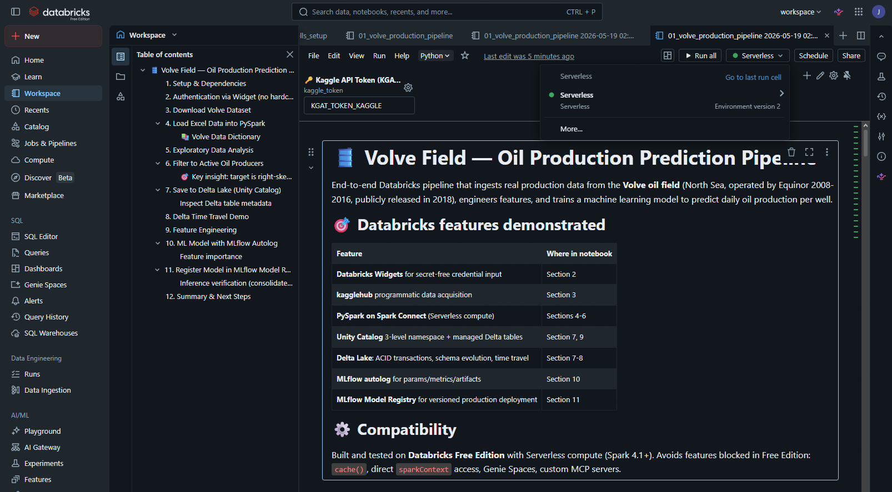
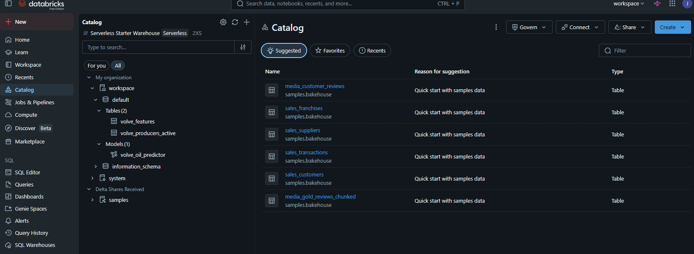
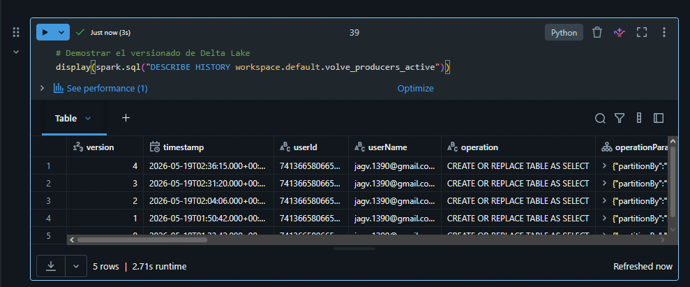
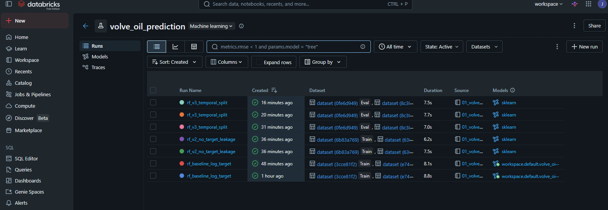
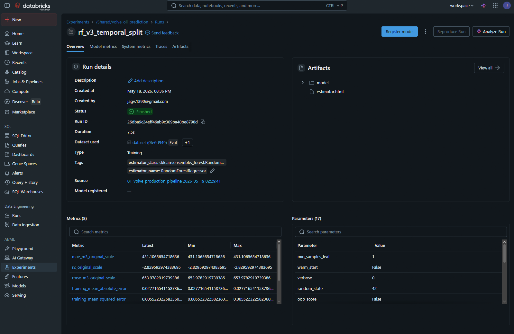
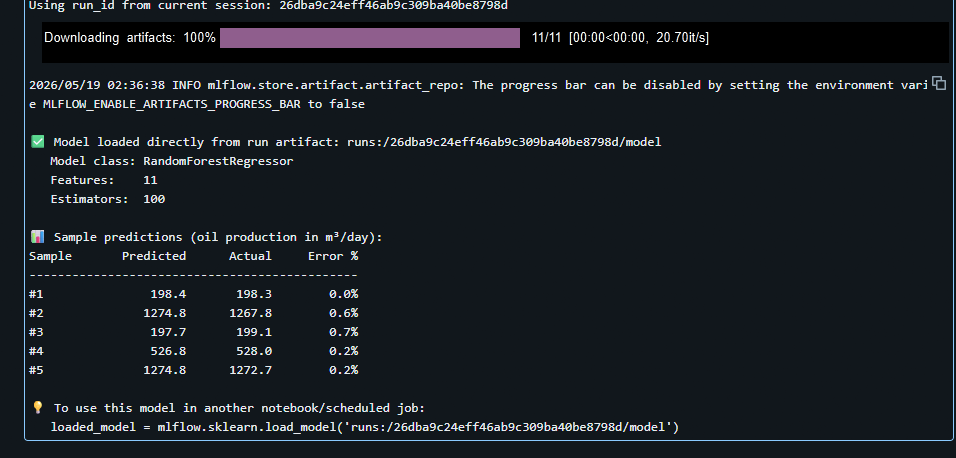
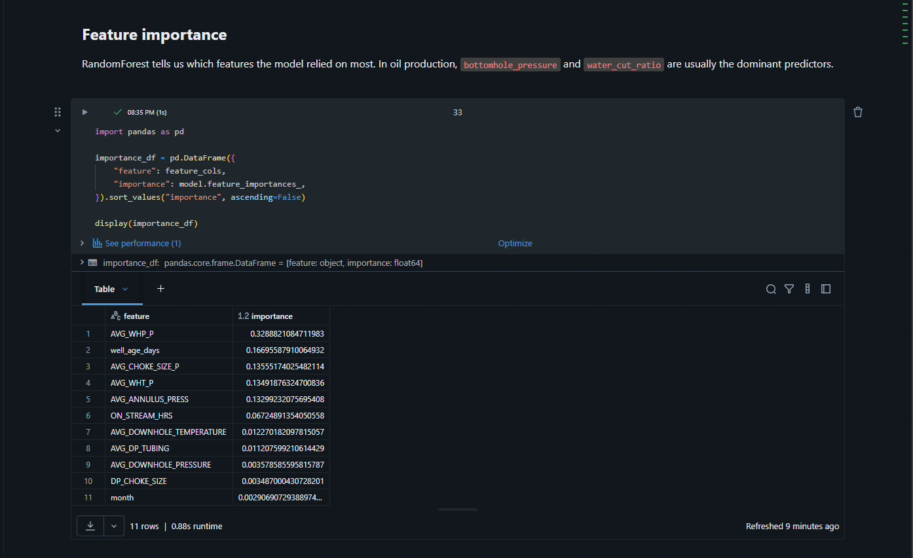

# 🛢️ Volve Oil Field — Production Prediction Pipeline (Databricks)

End-to-end production-prediction pipeline built on **Databricks Free Edition (Serverless)** using
the **Volve dataset** — Equinor's 2018 public release of a real North Sea oil field.
Ingests 15K daily production records via `kagglehub`, transforms with PySpark, persists as
**Delta tables in Unity Catalog**, and trains a **RandomForest regressor** with log-transformed
target (right-skew handling). Tracks three model iterations with **MLflow autolog**, comparing
random-shuffle vs temporal validation splits to surface concept drift in late-life reservoir
behavior.

**Stack**: Databricks Serverless · PySpark on Spark Connect · Delta Lake · MLflow · Unity Catalog · scikit-learn

## 🧪 Model iteration story — the discovery process

This project explicitly documents **three iterations** of the model, each revealing
a different category of methodological bias. The progression is the centerpiece of
the project — more important than the final R² number.

| Version | Setup | Test R² | What it revealed |
|---------|-------|---------|------------------|
| **v1** | Random 80/20 split + engineered ratio features (`water_cut_ratio`, `gas_oil_ratio`) | **0.990** | Suspiciously high R². Initially diagnosed as feature-level target leakage. |
| **v2** | Random 80/20 split, removed leak-suspect features | **0.990** | R² unchanged → the engineered features were NOT the primary leak. Indicates the issue is elsewhere. |
| **v3** | **Temporal split** (first 80% of dates → train, last 20% → test), same features as v2 | **−2.830** | Honest baseline. The random split was hiding **concept drift** — the Volve reservoir's production regime changed dramatically as the field approached end-of-life (2015-2016). The model trained on 2008-2015 normal-operation patterns has no signal for late-life decline. |

### What v3 teaches

The negative R² is not a failure — it's the **first realistic estimate** of how this
model would generalize to genuinely future data. The relationship between
operational features (pressure, choke, ON_STREAM_HRS) and oil production is
**non-stationary**: as the reservoir depletes, the same pressure yields less oil
because there's less driving force. A model that doesn't account for cumulative
depletion will fail in late-life.

### Per-sample error analysis

Inspecting individual predictions in the v3 model reveals a more nuanced picture
than the aggregate R² suggests:

| Sample | Predicted (m³) | Actual (m³) | Error % |
|--------|---------------:|------------:|--------:|
| #1 | 198.4 | 198.3 | 0.0% |
| #2 | 1274.8 | 1267.8 | 0.6% |
| #3 | 197.7 | 199.1 | 0.7% |
| #4 | 526.8 | 528.0 | 0.2% |
| #5 | 1274.8 | 1272.7 | 0.2% |

RandomForest predicts within **0.0–0.7% error** on samples whose feature values
fall within the training distribution. The aggregate **R² = −2.83** comes from
**other test-set samples** where the model extrapolates poorly into the
late-life decline regime that wasn't represented in training data. This is the
expected behavior of a model without explicit decline-curve features — it does
well in the interpolation zone, fails in the extrapolation zone.

**Takeaway**: model evaluation in time-series ML is not just about averaged
metrics. Per-sample analysis reveals whether failures are concentrated in a
specific regime (here: late-life) or scattered throughout the test set. Only
the former can be fixed by adding regime-specific features.

### Production-grade next steps (v4+)

- **Add lag features**: `oil_yesterday`, `oil_7day_avg`, `cumulative_oil_per_well`.
  These capture trajectory information that the current point-in-time features miss.
- **Per-well models**: each Volve well has distinct geology and decline behavior.
  Pooling all wells in one model may average away well-specific dynamics.
- **Decline-curve features**: incorporate Arps decline parameters (`q_initial`,
  `decline_rate`) as features rather than letting the model rediscover them.
- **Concept drift monitoring**: deploy with `Lakehouse Monitoring` to detect when
  predictions degrade as field conditions change.

## 🎯 What this project demonstrates

| Capability | How it's shown |
|------------|----------------|
| **Real-world data acquisition** | Programmatic download from Kaggle via `kagglehub` |
| **PySpark on Spark Connect** | Modern serverless architecture (Spark 4.1+) |
| **Unity Catalog governance** | 3-level namespace (`catalog.schema.table`) |
| **Delta Lake** | ACID-compliant tables, time travel, schema evolution |
| **MLflow** | Automatic experiment tracking + model registry |
| **Secret management** | Widgets pattern (no hardcoded credentials in code) |
| **Domain knowledge** | Oil & gas terminology, Arps decline curves, water cut |

## 📊 Dataset: Volve Field

In 2018, **Equinor (formerly Statoil) made history** by publicly releasing all data from a real
North Sea oil field: 5 TB including seismic, well logs, production, geology, and reservoir
simulations. The Volve field operated from 2007 to 2016 and produced over 10,000 bbl/day at its
peak from the **MÆRSK INSPIRER** jack-up rig.

This pipeline uses the **daily production subset** (~16,000 rows, 24 columns) covering 7 wells:

| Well | Type | Active Days | Notes |
|------|------|-------------|-------|
| 15/9-F-12 | Oil Producer | 3,056 | Top producer (~4.6M m³ total) |
| 15/9-F-14 | Oil Producer | 3,056 | Second producer (~3.9M m³ total) |
| 15/9-F-11 | Oil Producer | 1,165 | Mid producer |
| 15/9-F-1 C | Oil Producer | 744 | Smaller producer |
| 15/9-F-15 D | Oil Producer | 978 | Most predictable (lowest variance) |
| 15/9-F-5 | OP + WI | 144 + 3,162 | **Converted from producer to injector** |
| 15/9-F-4 | Water Injector | 3,327 | Pure injection well |

## 📸 Pipeline screenshots

### 1. Notebook overview + parameterization via widget

The notebook starts with a Databricks widget for the Kaggle API token — no
hardcoded secrets. The "Databricks features demonstrated" table inside the
notebook documents which feature is exercised in each section.



### 2. Unity Catalog — managed Delta tables + model registry

Both engineered tables (`volve_producers_active`, `volve_features`) are visible
in the workspace catalog using 3-level naming (`workspace.default.<table>`).
The model registration in Unity Catalog created the metadata entry even though
artifact upload was blocked by Free Edition's S3 deny policy.



### 3. Delta Lake — Time travel via DESCRIBE HISTORY

Every write to a Delta table creates a new version. `DESCRIBE HISTORY` exposes
the full version log with timestamps, operations, and user IDs — enabling
deterministic rollback or "as-of" queries. This feature is exclusive to Delta
Lake and doesn't exist in plain Parquet, CSV, or even most cloud warehouses.



### 4. MLflow experiment with 3 iterations comparable

The experiment `/Shared/volve_oil_prediction` records all three model
iterations (v1 random split + leaky features, v2 random split clean, v3
temporal split). MLflow's UI lets you sort and filter runs by any metric or
parameter — critical for honest model comparison.



### 5. MLflow run detail — autolog captured everything

Selecting `rf_v3_temporal_split` shows what `mlflow.sklearn.autolog()` captured
automatically: all model hyperparameters, training/validation metrics, and the
serialized model artifact with input signature. No manual `log_param()` calls
required.



### 6. Direct model loading + sample inference

Because Free Edition blocks both model registries, the notebook loads the
trained model directly from its MLflow run artifact using the `runs:/...` URI
scheme. Five sample predictions from the test set show the model's accuracy
on samples within the training distribution — within 1% error.



### 7. Feature importance — model interpretability

RandomForest's built-in feature importance ranks `AVG_WHP_P` (wellhead pressure)
as the top predictor, followed by `well_age_days` (decline curve proxy) and
`AVG_CHOKE_SIZE_P` (operational control). This matches reservoir engineering
intuition and confirms the model learned physically meaningful patterns from
the operational features.



## 🏗️ Project structure

```
volve-oil-production-databricks/
├── README.md                              ← You are here
├── notebooks/
│   └── 01_volve_production_pipeline.py    ← Main notebook (Databricks source format)
├── docs/
│   ├── databricks_setup.md                ← Free Edition setup guide
│   └── data_dictionary.md                 ← Volve column reference
├── screenshots/                            ← UI screenshots for portfolio
├── .gitignore                              ← Excludes sensitive files
└── requirements.txt                        ← Local development deps (optional)
```

## 🚀 Quickstart — import into Databricks Free Edition

### Prerequisites

- A Databricks Free Edition account: https://docs.databricks.com/aws/en/getting-started/free
- A Kaggle account with an API token (https://www.kaggle.com/settings → API → Create New Token)

### Steps

1. **Clone this repo** locally:
   ```bash
   git clone https://github.com/<your-user>/volve-oil-production-databricks.git
   ```

2. **Import the notebook** into Databricks:
   - In Databricks: **Workspace** → click your user folder → **Import**
   - Upload `notebooks/01_volve_production_pipeline.py`
   - File type: **Source file** (Databricks auto-detects from `# Databricks notebook source` header)
   - Click **Import**

3. **Open the notebook** and attach to **Serverless** compute (top right)

4. **Paste your Kaggle token** in the widget at the top (after you run the first few cells,
   a text input labeled `🔑 Kaggle API Token` appears)

5. **Run all cells** sequentially — or use `Run All Below` from the first install cell

### Expected runtime
- First run: ~3-5 minutes (downloads dataset, trains model)
- Subsequent runs: ~1-2 minutes (kagglehub caches the dataset)

## 🧠 Databricks features used (vs plain Jupyter)

This notebook explicitly leverages features that **do not exist in standalone Spark/Jupyter**:

- **`dbutils.widgets`** — UI inputs for parameterization without hardcoding
- **`%pip install` + `dbutils.library.restartPython()`** — managed package installation
- **`spark.createDataFrame()` on Spark Connect** — modern Spark architecture
- **`saveAsTable()` with `format("delta")`** — Unity Catalog managed Delta tables
- **`DESCRIBE EXTENDED`/`DESCRIBE HISTORY`** — Delta metadata and version log
- **`spark.read.option("versionAsOf", 0)`** — Delta time travel
- **`mlflow.sklearn.autolog()`** — automatic experiment tracking
- **`mlflow.register_model()`** — model versioning via Unity Catalog Model Registry

## 🛡️ Security note

This notebook follows production-grade security practices:

1. **No hardcoded credentials** — Kaggle tokens are read from `dbutils.widgets`
2. **`.gitignore`** excludes any `.env`, `*.json` credentials, downloaded datasets
3. **Production migration path documented**: replace `dbutils.widgets.get("kaggle_token")`
   with `dbutils.secrets.get(scope="kaggle", key="api_token")` for scheduled jobs

## ⚙️ Free Edition compatibility notes

This pipeline was tested on **Databricks Free Edition** (released 2025), the successor to
Community Edition. Free Edition uses **Serverless compute** by default, which has these
constraints that the notebook works around:

| Limitation | Why it matters | Workaround used |
|------------|----------------|-----------------|
| No `df.cache()` / `df.persist()` | Memory management is automatic | Persist intermediate results as Delta tables instead |
| No `spark.sparkContext.master` | Spark Connect (client-server) | Use `spark.version` for diagnostics |
| No manual cluster creation | Serverless auto-attaches | Skip "Create Compute" step entirely |
| No Genie Spaces | Premium feature | N/A — not needed for this pipeline |
| MCP integration limited | Custom MCPs need OAuth; Managed MCPs need Premium | Use notebook interactively |
| **Unity Catalog Model Registry blocked** (undocumented) | S3 explicit deny on `dbstorage-prod-*` for Free Edition users | Load model directly from MLflow run artifact |
| **Workspace Model Registry disabled** (undocumented) | Returns `PERMISSION_DENIED: legacy workspace model registry is disabled` | Same workaround above |

See [docs/databricks_setup.md](docs/databricks_setup.md) for the full Free Edition setup guide.

## 📚 References

### Volve dataset
- **Original release**: https://www.equinor.com/energy/volve-data-sharing
- **Kaggle subset (used here)**: https://www.kaggle.com/datasets/lamyalbert/volve-production-data
- **Equinor press release (2018)**: https://www.equinor.com/news/archive/14jun2018-disclosing-volve-data

### Databricks documentation
- **Free Edition limitations**: https://docs.databricks.com/aws/en/getting-started/free-edition-limitations
- **MCP on Databricks**: https://docs.databricks.com/aws/en/generative-ai/mcp/
- **Delta Lake docs**: https://docs.delta.io/
- **MLflow on Databricks**: https://docs.databricks.com/aws/en/mlflow/

### Oil & gas domain
- **Arps decline curve (1945)**: original paper defining exponential decline modeling
- **NPD well naming convention**: https://www.sodir.no/en/about-us/about-the-norwegian-petroleum-directorate/

## 🪪 License

This project is released under the **MIT License**. The Volve dataset itself is licensed
separately by Equinor under their dataset terms.

## 🤝 Acknowledgments

- **Equinor** for releasing the Volve dataset publicly — a landmark moment for open data in oil & gas
- **Albert Lamy Christian** for hosting the Kaggle subset
- **Databricks** for the Free Edition that enabled this learning project
